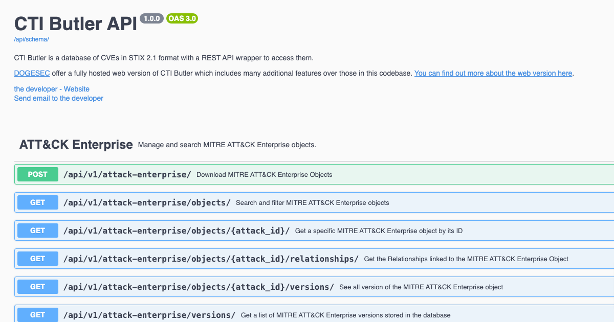

# CTI Butler

## Before you begin...

We offer a fully hosted web version of CTI Butler which includes many additional features over those in this codebase. [You can find out more about the web version here](https://www.ctibutler.com/).

## Overview



A web API for the following STIX 2.1 datasets:

* MITRE ATT&CK Enterprise
* MITRE ATT&CK ICS
* MITRE ATT&CK Mobile
* MITRE CAPEC
* MITRE CWE
* MITRE ATLAS
* Locations
* TLP
* DISARM

## tl;dr

[](https://www.youtube.com/watch?v=84SgT-ess4E)

[Watch the demo](https://www.youtube.com/watch?v=84SgT-ess4E).

## Install

### Download and configure

```shell
# clone the latest code
git clone https://github.com/muchdogesec/ctibutler
```

### Configuration options

CTI Butler has various settings that are defined in an `.env` file.

To create a template for the file:

```shell
cp .env.example .env
```

To see more information about how to set the variables, and what they do, read the `.env.markdown` file.

#### A note on ArangoDB secrets

Note, this script will not install an ArangoDB instance.

If you're new to ArangoDB, [you can install the community edition quickly by following the instructions here](https://arangodb.com/community-server/).

If you are running ArangoDB locally, be sure to set `ARANGODB_HOST_URL='http://host.docker.internal:8529'` in the `.env` file otherwise you will run into networking errors.

The script will create a database called `ctibutler_database`. The user selected for the `ARANGODB_USERNAME` should have read+write permissions to this database.

#### A note on Django and Postgres secrets

Note, if you intend on using this for testing, you can leave these variables as is. However, these need to be changed in a production install for security.

### Build the Docker Image

```shell
sudo docker compose build
```

### Start the server

```shell
sudo docker compose up
```

### Access the server

The webserver (Django) should now be running on: http://127.0.0.1:8006/

You can access the Swagger UI for the API in a browser at: http://127.0.0.1:8006/api/schema/swagger-ui/

## Quickstart

Once you've got CTI Butler running, you can use the following script to import all current and historical data. See `utilities/README.md`

## Support

[Minimal support provided via the DOGESEC community](https://community.dogesec.com/).

## License

[Apache 2.0](/LICENSE).